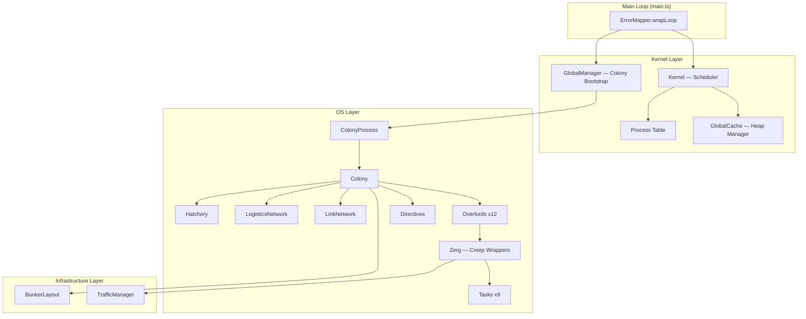

# Architecture Overview

[← Home](index)

The bot is structured as a **three-layer operating system** running inside the Screeps game loop. Each layer has a single responsibility and communicates with the layers above and below through well-defined interfaces.

---

## Layer Diagram

---

## Design Philosophy

| Principle | Implementation |
|---|---|
| **Process-centric execution** | All work runs as Kernel `Process` instances, subject to scheduling and CPU budgets |
| **Inversion of Control** | Overlords declare *what* they need; the Hatchery and Logistics Network fulfill it |
| **Heap-safe getters** | Never cache live `Creep`/`Room`/`Structure` objects — store IDs, resolve via getters each tick |
| **Serialization everywhere** | Processes, tasks, and cache all survive global resets via `Memory` persistence |
| **3-tier load shedding** | NORMAL → SAFE → EMERGENCY modes based on CPU bucket, preventing death spirals |

---

## Data Flow (One Tick)

1. **Boot** — `main.ts` detects global resets, restores Kernel from heap/Memory
2. **Bootstrap** — `GlobalManager` ensures every owned room has a `ColonyProcess`
3. **Schedule** — Kernel runs processes by priority bucket with CPU budgets
4. **Colony tick** — Each `ColonyProcess` calls `colony.refresh()` then `colony.run()`
5. **Overlord init** — Overlords adopt creeps via subreaper logic, enqueue spawn requests
6. **Overlord run** — Overlords assign tasks to their Zergs
7. **Zerg execution** — Each Zerg runs its current task (move + action)
8. **Traffic resolution** — `TrafficManager` resolves all movement intents
9. **Commit** — `GlobalCache.commit()` persists dirty state to Memory

---

**Related:** [Main Loop](main-loop) · [Kernel](kernel) · [Colony](colony) · [Design Patterns](design-patterns)
