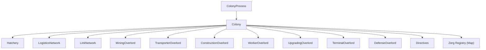

# Colony System

[← Home](index)

The **Colony** (`src/os/colony/Colony.ts`) is the central coordinator for a single owned room. It owns and orchestrates all subsystems: spawning, logistics, links, overlords, directives, and creep management.

---

## Architecture



A Colony is **not** a Process itself — it's a data/state container owned by a `ColonyProcess`, which runs under the Kernel's scheduler. This separation ensures Colony execution respects CPU budgets and load shedding.

---

## Key Properties

| Property | Type | Purpose |
|---|---|---|
| `name` | `string` | Room name (e.g. `"E1S1"`) |
| `memory` | `ColonyMemory` | Persisted state (anchor position, last RCL) |
| `state` | `ColonyState` | Per-tick flags (e.g. `rclChanged`) |
| `overlords` | `Overlord[]` | All registered overlords |
| `directives` | `Directive[]` | Active flag-driven missions |
| `zergs` | `Map<string, Zerg>` | Registry of all creep wrappers |
| `logistics` | `LogisticsNetwork` | Resource request/offer matching |
| `linkNetwork` | `LinkNetwork` | Inter-link energy transfers |
| `hatchery` | `Hatchery` | Spawn queue management |

---

## Heap-Safe Getters

Colony persists in the global heap. It **never** caches live Game objects:

```typescript
// ✅ Correct — resolves fresh each tick
get room(): Room | undefined {
    return Game.rooms[this.name];
}

// ✅ Correct — global scan filtered by memory
get creeps(): Creep[] {
    return Object.values(Game.creeps)
        .filter(c => c.memory?.colony === this.name);
}
```

Both getters are memoized per-tick (checked against `Game.time`) to avoid redundant scans.

---

## Tick Lifecycle

Called by `ColonyProcess.run()` each tick:

### `refresh()`
1. Refresh LogisticsNetwork, Hatchery, and LinkNetwork
2. Detect RCL changes (for construction replanning)
3. Prune dead Zergs from the registry

### `run()`
1. **Directives** — `init()` then `run()` each directive
2. **Overlords** — `init()` (adopt creeps, enqueue spawns) then `run()` (assign tasks)
3. **Logistics** — `init()` to register infrastructure requests
4. **Hatchery** — `run()` to process the spawn queue
5. **Zergs** — `run()` each Zerg to execute its assigned task
6. **Links** — `init()` + `run()` for inter-link energy transfers

---

## Zerg Management

| Method | Purpose |
|---|---|
| `registerZerg(creep)` | Create or retrieve a Zerg wrapper, add to registry |
| `getZerg(name)` | Lookup by creep name |

Dead Zergs are pruned during `refresh()` to prevent registry growth.

---

**Related:** [Hatchery](hatchery) · [Logistics](logistics) · [Overlords](overlords) · [Process Model](processes)
