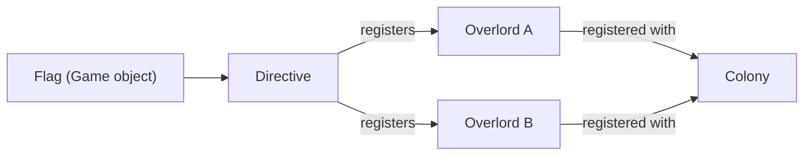
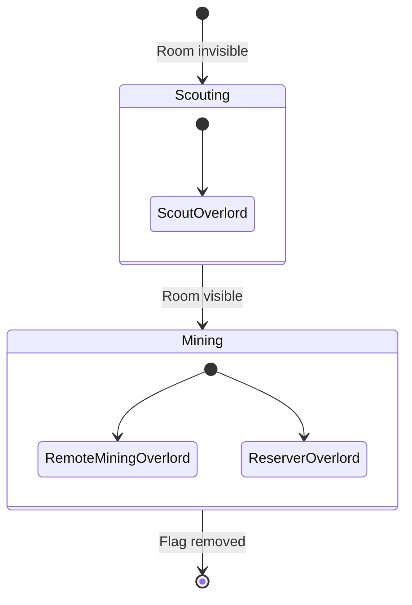

# Directives

[← Home](index)

A **Directive** (`src/os/directives/Directive.ts`) wraps a game `Flag` and represents a strategic objective. Directives are the primary mechanism for multi-room and mission-based operations.

---

## Design

Directives keep `Colony.ts` clean by encapsulating all mission logic:



- Colony scans for active Directives during `initDirectives()`
- Each Directive instantiates the Overlords it needs
- Overlords are registered with the Colony for scheduling

---

## Abstract Base Class

```typescript
abstract class Directive {
    flagName: string;        // Stored as string (heap-safe)
    colony: Colony;
    roomName: string;
    overlords: Overlord[];

    get flag(): Flag | undefined;       // Resolve live flag
    get pos(): RoomPosition | undefined;
    get targetRoom(): string;           // Parsed from "inc:W2N1" → "W2N1"
    get isTargetVisible(): boolean;

    registerOverlord(overlord: Overlord): void;
    abstract init(): void;
    abstract run(): void;
}
```

---

## Flag Naming Convention

Directives are triggered by placing flags with specific prefixes:

| Prefix | Directive | Example |
|---|---|---|
| `inc:` | HarvestDirective | `inc:W2N1` — harvest remote room W2N1 |

The `targetRoom` getter extracts the room name after the colon.

---

## HarvestDirective — Deep Dive

The `HarvestDirective` orchestrates remote room exploitation through phased overlord deployment:



### Phase 1: Scouting
- Target room is **not visible** (no creeps there)
- Spawns a `ScoutOverlord` → sends a `[MOVE]` creep to gain vision

### Phase 2: Mining + Reservation
- Target room is **visible**
- Calculates path distance from home spawn to remote room
- Spawns `RemoteMiningOverlord` for each source
- Spawns `ReserverOverlord` if the room has a neutral controller

### Distance Calculation
- Uses `PathFinder.search()` with `maxOps: 10000` for cross-room paths
- Falls back to `getRoomLinearDistance() * 50` if path is incomplete

---

**Related:** [Colony](colony) · [Overlords](overlords) · [Architecture](architecture)
