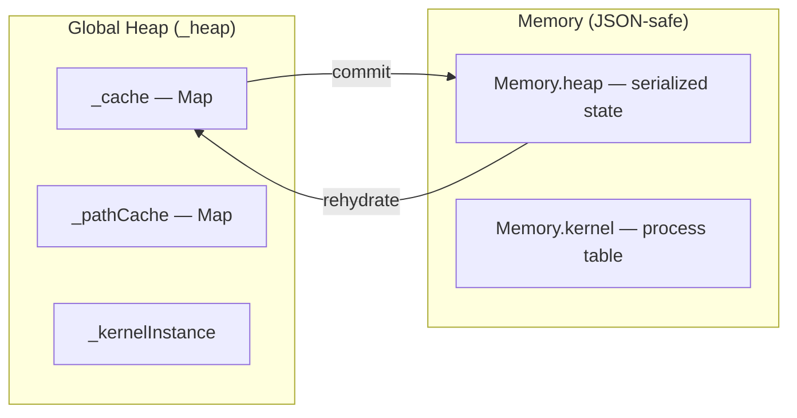

# GlobalCache & Memory Management

[← Home](index)

The **GlobalCache** (`src/kernel/GlobalCache.ts`) provides heap-first state management with automatic global reset detection. The **GlobalManager** (`src/kernel/GlobalManager.ts`) handles per-tick colony bootstrapping.

---

## The Problem: Global Resets

Screeps can wipe the global JavaScript object at any time. When this happens:
- All heap-cached data is lost (class instances, Maps, caches)
- `Memory` persists (it's serialized to JSON each tick)
- The bot must reconstruct its entire runtime state in one tick

---

## GlobalCache Architecture



### Key Methods

| Method | Purpose |
|---|---|
| `isGlobalReset()` | Returns `true` exactly once per global lifecycle. Records timestamp in `Memory.kernel.lastGlobalReset` |
| `rehydrate(key, generator, serializer?)` | **The core pattern.** Checks heap first → falls back to Memory → runs generator with saved state |
| `get(key)` / `set(key, value)` | Direct heap cache access |
| `markDirty(key)` | Flag a key for serialization at end of tick |
| `commit()` | Write all dirty keys to `Memory.heap` via their registered serializers |
| `getPathCache()` | Direct access to the path cache (used by Zerg movement) |

---

## The Rehydrate Pattern

This is the most important pattern in the codebase. It solves the "Amnesia Bug" — state loss after a global reset:

```typescript
const colony = GlobalCache.rehydrate(
    `ColonyObj:${roomName}`,     // Unique key
    (savedState) => {            // Generator — receives Memory state if available
        return new Colony(roomName);
    }
);
```

**Flow:**
1. Check `_heap._cache` for the key → return immediately if found (fast path)
2. Check `Memory.heap[key]` for serialized state → pass to generator
3. Run generator to create the object → cache in heap
4. If a serializer is registered, future `commit()` calls will persist it

---

## Dirty Key Tracking

Instead of serializing everything every tick, GlobalCache uses a dirty-tracking pattern:

```typescript
GlobalCache.markDirty("pendingSpawns");  // Flag for commit
// ... later ...
GlobalCache.commit();  // Only serializes dirty keys
```

This dramatically reduces the CPU cost of Memory serialization.

---

## GlobalManager

The GlobalManager is the "warm start" initializer. Each tick it:

1. Iterates `Game.rooms` for owned rooms
2. Checks if a `ColonyProcess` with `processId: "colony:<roomName>"` exists in the Kernel
3. If missing, spawns a new `ColonyProcess` at priority 0

This replaced a previous pattern of instantiating Colony objects directly (the "Two Masters" anti-pattern) which bypassed load shedding and kernel panics.

---

## Heap Structure

The global `_heap` variable (declared in `types.d.ts`) contains:

```typescript
interface HeapCache {
    _initialized: boolean;
    _kernelInstance: Kernel | undefined;
    _cache: Map<string, unknown>;
    _pathCache: Map<string, { path: string; tick: number }>;
    _dirty?: Set<string>;
    _serializers?: Map<string, () => unknown>;
}
```

---

**Related:** [Kernel](kernel) · [Process Model](processes) · [Main Loop](main-loop)
