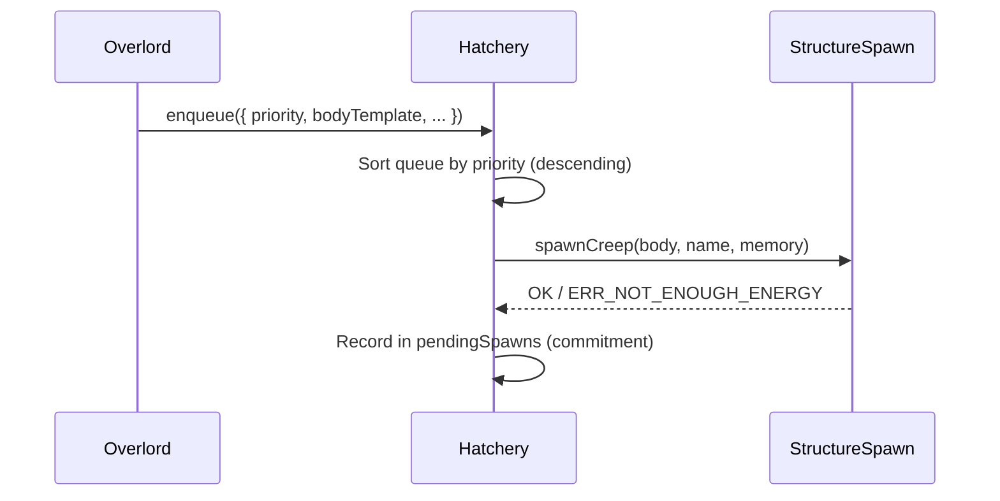

# Hatchery & Spawning

[← Home](index)

The **Hatchery** (`src/os/colony/Hatchery.ts`) manages spawn structures and a priority-based spawn queue. Overlords declare what they need; the Hatchery fulfills requests based on priority and available energy.

---

## Spawn Queue

Each tick, the queue is cleared and rebuilt by Overlords during their `init()` phase:



### SpawnRequest

```typescript
interface SpawnRequest {
    priority: number;           // Higher = more important
    bodyTemplate: BodyPartConstant[]; // Template to scale
    overlord: Overlord;         // Requesting overlord
    name?: string;              // Creep name
    memory?: any;               // Initial creep memory
    maxEnergy?: number;         // Cap morphological growth
}
```

---

## Body Scaling

Bodies are built using `CreepBody.grow(template, energyCapacity)`:

- The template (e.g. `[WORK, CARRY, MOVE]`) is repeated as many times as the energy budget allows
- Overlords can set `maxEnergy` to prevent over-scaling
- If the template is too expensive for room capacity, the request is dropped

---

## Emergency Mode (Deadlock Prevention)

When **zero** critical creeps (miners + workers) exist, the Hatchery activates emergency mode:

1. **Halts the normal queue** to stockpile energy
2. **Waits for 200 energy** (minimum for `[WORK, CARRY, MOVE]`)
3. **Spawns a bootstrapper** with the `worker` role
4. **Resumes normal queue** once critical creeps exist again

This prevents the "empty colony" deadlock where no creeps exist to gather energy for spawning.

---

## Spawn Commitment Handshake

The Hatchery uses a 3-phase handshake via `GlobalCache` to track creeps-in-progress:

| Phase | Event | Action |
|---|---|---|
| **I — Commit** | `spawnCreep()` returns `OK` | Add name to `pendingSpawns` set |
| **II — Spawning** | Creep exists but `creep.spawning = true` | Remains in `pendingSpawns` |
| **III — Alive** | Creep exists and `spawning = false` | Remove from `pendingSpawns` |

This prevents double-spawning and allows the Logistics Network to pre-allocate resources for creeps that are still materializing.

---

## Virtual Energy Tracking

When multiple spawns are available, the Hatchery tracks a **virtual energy** counter to prevent two spawns from both trying to spend the same pool of extensions:

```typescript
let virtualEnergyAvailable = room.energyAvailable;
// After each successful spawn:
virtualEnergyAvailable -= bodyCost;
```

---

## Heap-Safe Design

Hatchery stores `spawnIds: Id<StructureSpawn>[]` and `extensionIds: Id<StructureExtension>[]` — never live Game objects. Getters resolve them fresh each access:

```typescript
get spawns(): StructureSpawn[] {
    return this.spawnIds
        .map(id => Game.getObjectById(id))
        .filter((s): s is StructureSpawn => s !== null);
}
```

---

**Related:** [Colony](colony) · [Overlords](overlords) · [Logistics](logistics)
