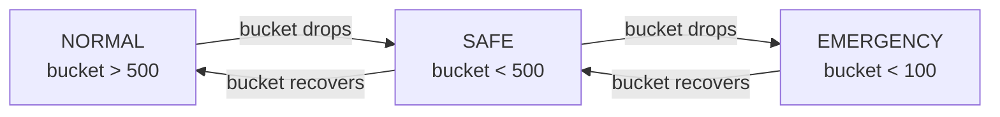
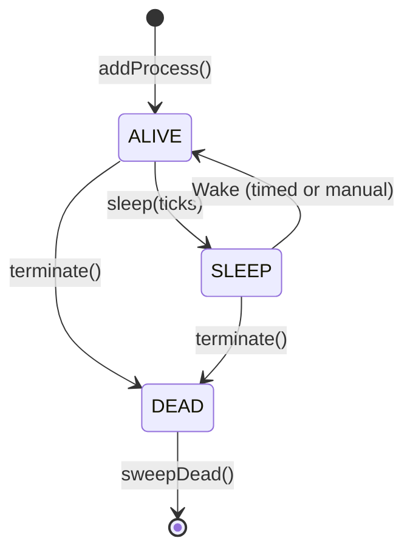

# Kernel & Scheduler

[← Home](index)

The **Kernel** (`src/kernel/Kernel.ts`) is the heart of the OS. It maintains a process table, schedules processes by priority, and enforces per-tick CPU budgets with a 3-tier load shedding governor.

---

## Core Responsibilities

| Capability | Implementation |
|---|---|
| **Process Table** | `Map<number, Process>` keyed by PID, plus O(1) indexes by `processId` and `processName` |
| **Priority Scheduling** | Bucketed priority queue — O(P) iteration replaces O(N log N) sort |
| **CPU Budgets** | Dynamic limit based on bucket health; uses `Game.cpu.tickLimit` when healthy |
| **Load Shedding** | 3-tier governor skips non-essential processes when CPU bucket is low |
| **Wake Map** | O(1) timed wake — processes self-register at sleep time, Kernel wakes them at the target tick |
| **Generator Coroutines** | `run()` may return a `Generator`; Kernel calls `.next()` each tick until done |
| **Serialization** | Process table serialized to `Memory.kernel.processTable` for global reset survival |
| **CPU Profiling** | Per-process CPU deltas recorded each tick for the Profiler |

---

## Scheduler Modes (CPU Governor)

The scheduler dynamically selects a mode based on `Game.cpu.bucket`:



| Mode | Behavior |
|---|---|
| **NORMAL** | All processes execute. Burst CPU allowed (`tickLimit`) |
| **SAFE** | Skip processes with `priority > 2`. Only critical work runs |
| **EMERGENCY** | Only priority 0 + kernel core. Triggers `onKernelPanic()` |

### Panic Behavior

When the bucket drops below the emergency threshold, `onKernelPanic()` fires:
- Sets a panic flag readable by `isPanicActive()`
- Logs a warning with current bucket level
- Non-essential creeps effectively idle (their Overlord processes are skipped)

---

## Process Lifecycle in the Scheduler



Each tick, the `Kernel.run()` method:

1. **Determine scheduler mode** from CPU bucket level
2. **Wake sleeping processes** whose `sleepUntil <= Game.time` via the O(1) wake map
3. **Iterate priority buckets** (0, 1, 2, …) in ascending order
4. **Skip entire buckets** if the mode's priority threshold is lower
5. **Execute each alive process** — either resume its generator thread or call `run()`
6. **Track CPU deltas** per process for the profiler
7. **Check CPU budget** after each process; stop if over limit
8. **Sweep dead processes** — remove all DEAD entries from all indexes
9. **Serialize to Memory** — persist the process table for global reset recovery

---

## Key Methods

| Method | Purpose |
|---|---|
| `addProcess(process)` | Register a process, assign PID, inject Kernel reference |
| `removeProcess(pid)` | Mark as DEAD and sweep |
| `getProcessById(id)` | O(1) lookup by stable `processId` |
| `hasProcessId(id)` | O(1) existence check |
| `registerWake(pid, tick)` | Schedule a wake at a specific Game.time |
| `run()` | Core scheduler loop |
| `serialize()` / `deserialize()` | Persist/restore process table |
| `saveToHeap()` / `loadFromHeap()` | Fast heap-based persistence between ticks |

---

## Process Factories

Before deserialization can restore processes, each process type must register a factory:

```typescript
kernel.registerProcess("colony", (desc) => {
    const proc = new ColonyProcess(desc.pid, desc.priority, desc.parentPID, desc.data.colonyName);
    return proc;
});
```

This mapping from `processName` → factory function is what allows the Kernel to reconstruct arbitrary process types from their serialized descriptors.

---

**Related:** [Process Model](processes) · [Main Loop](main-loop) · [Architecture](architecture)
