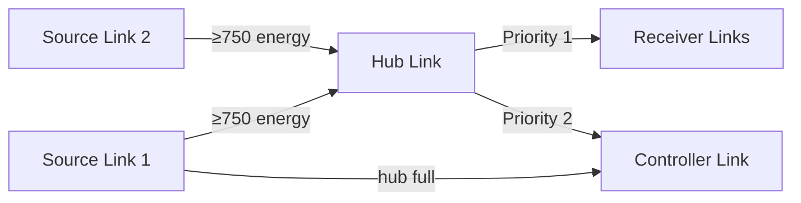

# Link Network

[← Home](index)

The **LinkNetwork** (`src/os/colony/LinkNetwork.ts`) manages automated energy transfers between `StructureLink` buildings, creating a zero-hauler energy pipeline from sources to the hub and controller.

---

## Link Classification

Links are classified by proximity during a throttled layout scan (every 50 ticks):

| Type | Detection Rule | Purpose |
|---|---|---|
| **Source Link** | Range ≤ 2 to a Source | Collects miner output |
| **Hub Link** | Range ≤ 2 to Storage | Central distribution point |
| **Controller Link** | Range ≤ 3 to Controller | Feeds upgraders |
| **Receiver Link** | Everything else | Extension/tower support |

---

## 2-Phase Energy Shuttle



### Phase 1: Collection (Source → Hub)
- Source links transfer when they accumulate ≥ 750 energy
- Prefer hub link if it has capacity
- Fall back to controller link if hub is full/on cooldown

### Phase 2: Distribution (Hub → Receivers/Controller)
- Hub distributes to receivers first (towers/extensions via haulers)
- Then to controller link for upgraders
- Only one transfer per tick per link (game constraint)

---

## Virtual Capacity Tracking

To prevent two source links from simultaneously overfilling the hub:

```typescript
let virtualHubFreeCapacity = hubLink.store.getFreeCapacity(RESOURCE_ENERGY);
// After each successful transfer:
virtualHubFreeCapacity -= amountToSend;
```

---

## Heap-Safe Design

All link references are stored as `Id<StructureLink>` arrays, resolved via getters:

```typescript
get sourceLinks(): StructureLink[] {
    return this.sourceLinkIds
        .map(id => Game.getObjectById(id))
        .filter((l): l is StructureLink => l !== null);
}
```

---

**Related:** [Colony](colony) · [Logistics](logistics) · [Overlords — Mining](overlords)
