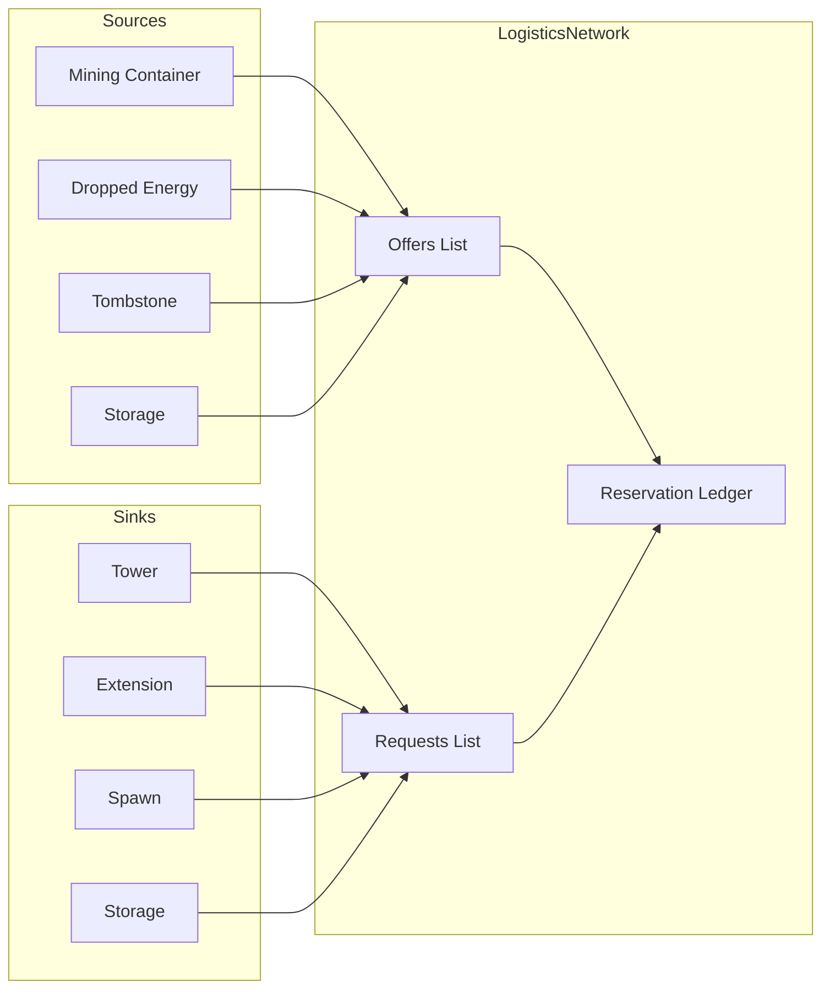

# Logistics Network

[← Home](index)

The **LogisticsNetwork** (`src/os/colony/LogisticsNetwork.ts`) is a centralized resource broker. It matches haulers (Transporters) with energy sources and sinks using a scoring system that balances urgency against distance.

---

## Concepts

| Term | Meaning |
|---|---|
| **Offer** | A source of resources (containers, dropped resources, tombstones, storage) |
| **Request** | A sink that needs resources (towers, extensions, spawns, controller link) |
| **Reservation** | A virtual "claim" on a target by an assigned hauler |

---

## Request / Offer Model



---

## Infrastructure Auto-Registration

Each tick during `init()`, the network scans the room and registers:

| Structure | Role | Priority |
|---|---|---|
| Dropped resources (≥50 energy) | Offer | — |
| Tombstones with energy | Offer | — |
| Containers near sources | Offer | — |
| Towers (< capacity) | Request | **8** (high) |
| Extensions (< capacity) | Request | **7** |
| Spawns (< capacity) | Request | **7** |
| Storage (< 750,000) | Request | **1** (low, buffer) |
| Storage (> 0 energy) | Offer | — |
| Terminal | Both | Context-dependent |

---

## Matching Algorithm

### `matchWithdraw(zerg)` — Find energy to collect

Scores each offer by:

```
score = effectiveAmount / max(1, distance)
```

Where `effectiveAmount = actualAmount - outgoingReservations` (prevents multiple haulers from targeting the same small pile).

### `matchTransfer(zerg)` — Find where to deliver

Scores each request by:

```
score = priority / max(1, distance)
```

Higher-priority sinks (towers, extensions) beat lower-priority ones (storage) at equal distance.

---

## Reservation Ledger

The ledger prevents over-assignment. It's **rebuilt from scratch each tick** by scanning active Zerg tasks:

```typescript
rebuildLedger(): void {
    this.incomingReservations.clear();
    this.outgoingReservations.clear();
    for (const zerg of this.colony.zergs.values()) {
        // If zerg has a TransferTask → increment incoming for target
        // If zerg has a WithdrawTask → increment outgoing for target
    }
}
```

This stateless-per-tick approach avoids stale reservations from dead creeps without any explicit cleanup logic.

---

## API

| Method | Purpose |
|---|---|
| `requestInput(targetId, opts)` | Register a sink (structure needing resources) |
| `requestOutput(targetId, opts)` | Register a source (structure offering resources) |
| `matchWithdraw(zerg)` | Find the best pickup target for an empty hauler |
| `matchTransfer(zerg)` | Find the best delivery target for a loaded hauler |
| `getEffectiveAmount(targetId)` | Actual amount minus outgoing reservations |

---

**Related:** [Colony](colony) · [Overlords — Transporter](overlords) · [Hatchery](hatchery)
