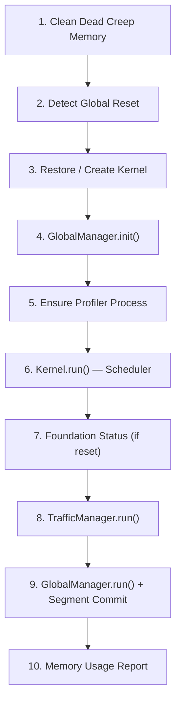

# Main Loop & Boot Sequence

[← Home](index)

The entry point is `src/main.ts`, which exports a single `loop` function wrapped in `ErrorMapper.wrapLoop()` for source-mapped stack traces.

---

## Tick Lifecycle (10 Steps)

### Step-by-Step

| # | Step | Detail |
|---|---|---|
| 1 | **Memory cleanup** | Prune `Memory.creeps` for dead creeps. Offset to tick 3 to avoid synchronized spikes (Temporal Throttling) |
| 2 | **Global reset detection** | `GlobalCache.isGlobalReset()` checks if the V8 heap was wiped |
| 3 | **Kernel restore** | Load from heap (`loadFromHeap`) or deserialize from Memory. Falls back to fresh Kernel on first boot |
| 4 | **GlobalManager.init** | Scans `Game.rooms` for owned rooms, ensures each has a `ColonyProcess` registered in the Kernel |
| 5 | **Profiler** | Ensures the `ProfilerProcess` (priority 0) is running for CPU/scheduler monitoring |
| 6 | **Kernel.run** | The core scheduler — runs all processes by priority bucket with CPU budgets and load shedding |
| 7 | **Foundation status** | On first tick after reset, prints Kernel state, process count, and scheduler mode to console |
| 8 | **Traffic resolution** | `TrafficManager.run()` resolves all registered movement intents with collision handling |
| 9 | **End-of-tick commit** | `GlobalManager.run()` placeholder + `SegmentManager.commit()` sets active segments for next tick |
| 10 | **Heap report** | Every 100 ticks (offset by 47), logs heap usage and CPU bucket level |

---

## Global Reset Recovery

When the Screeps VM resets the global object:

1. `GlobalCache.isGlobalReset()` returns `true` on the first tick
2. Heap caches (`_heap._cache`, `_heap._pathCache`) are reinitialized
3. Kernel is deserialized from `Memory.kernel.processTable`
4. Each Process is reconstructed via its registered `ProcessFactory`
5. Colony objects are rehydrated via `GlobalCache.rehydrate()`
6. Tasks on Zergs are reconstructed from `CreepMemory.task` on first access

The entire system is back to full operation within **a single tick**.

---

## Console Commands

| Command | Description |
|---|---|
| `setLogLevel("debug")` | Change log verbosity (debug/info/warning/error) |
| `resetBot()` | Wipe Memory + heap, force fresh bootstrap |
| `testError()` | Trigger a deep error to verify source-map resolution |

---

**Related:** [Architecture](architecture) · [Kernel](kernel) · [GlobalCache](global-cache)
