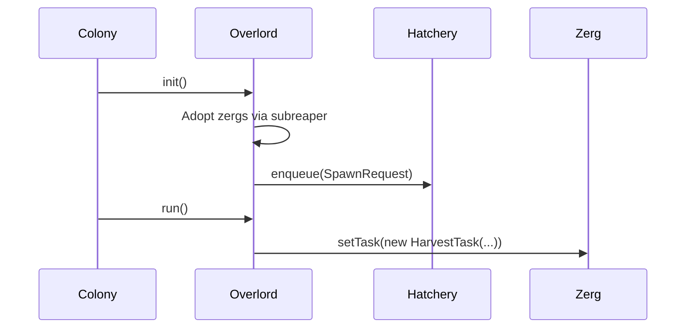

# Overlords

[← Home](index)

An **Overlord** (`src/os/overlords/Overlord.ts`) is a task manager responsible for a specific role. It adopts creeps, decides what they should do, and requests new spawns when needed. The Colony registers overlords during initialization and calls their `init()` → `run()` lifecycle each tick.

---

## Base Class

```typescript
abstract class Overlord {
    colony: Colony;
    processId: string;      // e.g. "miner", "transporter", "worker"

    get zergs(): Zerg[];    // Subreaper adoption (see below)
    abstract init(): void;  // Adopt creeps, enqueue spawns
    abstract run(): void;   // Assign tasks to zergs
    addZerg(zerg: Zerg): void;
}
```

---

## Subreaper Adoption (Orphan Recovery)

After a global reset, the heap is wiped — Overlords lose their creep references. The `zergs` getter reconstructs them **every tick** by scanning the Colony's creep list:

```typescript
get zergs(): Zerg[] {
    const allCreeps = this.colony.creeps;
    const myCreeps = allCreeps.filter(
        c => c.memory._overlord === this.processId
    );
    return myCreeps.map(c => this.colony.registerZerg(c));
}
```

This guarantees instant creep re-adoption after any reset — no serialization needed.

---

## Overlord Catalog

### Economy

| Overlord | Role | Body Template | Behavior |
|---|---|---|---|
| **MiningOverlord** | Static miners | `[WORK, WORK, MOVE]` | Parks on source, harvests continuously. Creates `MiningSite` infrastructure (container + link) |
| **TransporterOverlord** | Haulers | `[CARRY, CARRY, MOVE]` | Collects from offers, delivers to requests via LogisticsNetwork. Road repair-on-transit |
| **WorkerOverlord** | Build + repair | `[WORK, CARRY, MOVE]` | Builds construction sites, repairs structures. Emergency harvest fallback |
| **UpgradingOverlord** | Controller upgraders | `[WORK, CARRY, MOVE]` | Upgrades controller. Spawn-gated by infrastructure availability |
| **ConstructionOverlord** | Bunker planner | N/A (no creeps) | Reads `BunkerLayout`, places construction sites filtered by RCL |

### Defense

| Overlord | Role | Body Template | Behavior |
|---|---|---|---|
| **DefenseOverlord** | Tower control + military | Combat bodies | Manages tower targeting, spawns defenders during invasions |
| **DestroyerOverlord** | Offensive | `[WORK, MOVE]` dismantlers | Targets hostile structures for destruction |

### Remote Operations

| Overlord | Role | Body Template | Behavior |
|---|---|---|---|
| **RemoteMiningOverlord** | Remote miners | `[WORK, WORK, MOVE]` | Mines sources in remote rooms, registers with parent colony logistics |
| **ReserverOverlord** | Room reservation | `[CLAIM, MOVE]` | Reserves remote controllers to double source capacity |
| **ScoutOverlord** | Visibility | `[MOVE]` | Sends a single creep to gain vision of an unexplored room |
| **TerminalOverlord** | Market/terminal | N/A | Manages `StructureTerminal` operations |

---

## Init → Run Lifecycle



---

**Related:** [Colony](colony) · [Zerg](zerg) · [Tasks](tasks) · [Hatchery](hatchery)
