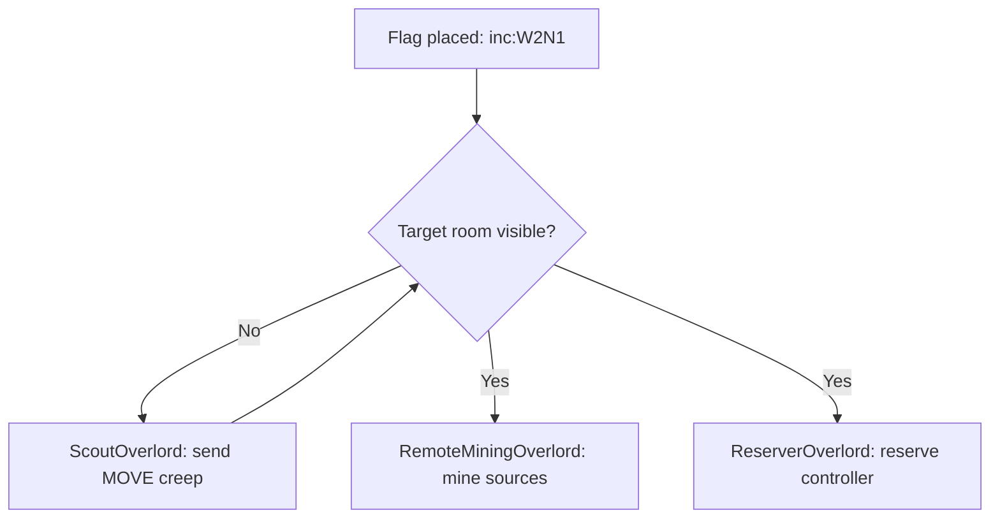

# Remote Mining — Directive System

## Overview

Remote mining is driven by **Directives** — flag-based mission objects that orchestrate Overlords across room boundaries. Placing a flag creates a chain of automated actions: scouting, reserving, mining, and hauling.

## Flag Convention

| Flag Name    | Example     | Effect                                  |
|-------------|-------------|------------------------------------------|
| `inc:ROOM`  | `inc:W2N1`  | Initiates remote harvest in target room  |

## Lifecycle



### Phase 1: Scouting
When the target room is invisible (`Game.rooms[target]` is undefined), a **ScoutOverlord** spawns a single `[MOVE]` creep (50 energy) to travel to the room center. Once the room enters visibility, the scout's job is done.

### Phase 2: Mining & Reservation
Once the room is visible:
- **RemoteMiningOverlord** creates `MiningSite` objects for each source, with distance calculated from the home colony spawn. It manages remote miners (`[W,W,W,W,W,M,M,M]`) and haulers (`[C,M]` scaled) using the same part-count balancing as local mining.
- **ReserverOverlord** implements Buffer Cycling (see below).

## Buffer Cycling — Reservation Math

Reserving a controller requires expensive `CLAIM` parts (600 energy each). Buffer Cycling minimizes cost by only spawning a Reserver when necessary.

**Formula**: Spawn a Reserver when:
```
ticksToEnd < Distance + SpawnTime + SafetyBuffer
```

| Parameter       | Value  | Description                                |
|-----------------|--------|--------------------------------------------|
| `Distance`      | varies | Path length from home spawn to controller  |
| `SpawnTime`     | 12     | 4 parts × 3 ticks/part                    |
| `SafetyBuffer`  | 500    | Accounts for travel variance/congestion    |

**Body**: `[CLAIM, CLAIM, MOVE, MOVE]` — net +1 reservation tick/tick after the natural -1 decay, maintaining reservation indefinitely with minimal overlap.

**Example**: At distance 50, threshold = 562 ticks. If `ticksToEnd = 400`, a new Reserver is spawned. If `ticksToEnd = 3000`, none is spawned.

## Colony Integration

`Colony.initDirectives()` scans `Game.flags` for `inc:` prefixed flags each tick:
- Creates a `HarvestDirective` for each matching flag
- Directives register their Overlords with the Colony
- Colony's `run()` calls `directive.init()` → `overlord.init()` → `directive.run()` → `overlord.run()`

## Console Output

When remote mining activates, you'll see:
```
Directive: Remote Mining initiated in W2N1. Distance: 52. Reservation Status: 4500.
```
