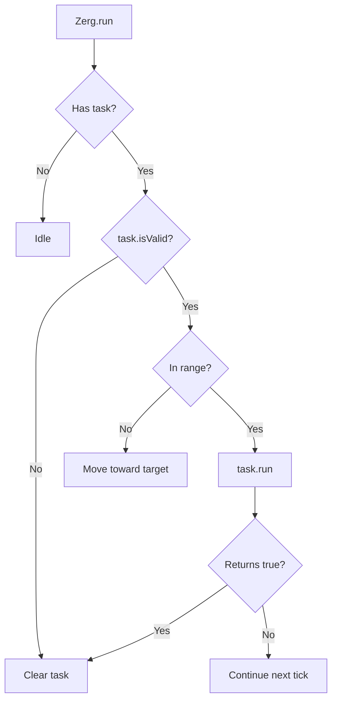

# Task System

[← Home](index)

**Tasks** (`src/os/tasks/`) are atomic, serializable actions that a [Zerg](zerg) can execute. They form the lowest level of the execution hierarchy: Overlords decide *what* to do, then assign Tasks that Zergs execute blindly.

---

## ITask Interface

```typescript
interface ITask {
    readonly name: string;           // e.g. "Harvest", "Transfer"
    settings: TaskSettings;

    run(zerg: Zerg): boolean;        // Execute; return true when complete
    isValid(): boolean;              // Is the target still valid?
    serialize(): TaskMemory;         // Persist to CreepMemory
}
```

### TaskSettings

| Setting | Type | Purpose |
|---|---|---|
| `targetRange` | `number` | Range at which to start moving toward the target |
| `workRange` | `number` | Range at which the action can execute |
| `oneShot` | `boolean?` | Complete after a single successful action |
| `targetHits` | `number?` | Complete when target HP reaches this value |

### TaskMemory

```typescript
interface TaskMemory {
    name: string;       // Task type → used by deserializer
    targetId: string;   // Game object ID
    settings: TaskSettings;
}
```

---

## Task Catalog

| Task | Target | Action | Range | Notes |
|---|---|---|---|---|
| **HarvestTask** | `Source` | `harvest()` | 1 | Repeats until source depleted or creep full |
| **BuildTask** | `ConstructionSite` | `build()` | 3 | Completes when site finishes or creep empty |
| **RepairTask** | `Structure` | `repair()` | 3 | Completes at `targetHits` or `hitsMax` |
| **UpgradeTask** | `StructureController` | `upgradeController()` | 3 | Repeats until creep energy empty |
| **TransferTask** | `Structure` or `Creep` | `transfer()` | 1 | One-shot: transfers once then completes |
| **WithdrawTask** | `Structure`, `Tombstone`, `Ruin` | `withdraw()` | 1 | One-shot: withdraws once then completes |
| **PickupTask** | `Resource` (dropped) | `pickup()` | 1 | One-shot: picks up once then completes |
| **ReserveTask** | `StructureController` | `reserveController()` | 1 | Repeats until reservation at threshold |

---

## Task Execution Flow



---

## Serialization & Global Reset Recovery

Tasks serialize to `CreepMemory.task` as JSON-safe `TaskMemory` objects. After a global reset:

1. Zerg's `task` field is `null` (heap wiped)
2. On first `run()`, Zerg checks `memory.task`
3. `deserializeTask()` reconstructs the task using the `name` field as a key
4. Execution resumes seamlessly

```typescript
deserializeTask(taskMem: TaskMemory): ITask | null {
    switch (taskMem.name) {
        case "Harvest":  return new HarvestTask(taskMem.targetId, ...);
        case "Transfer": return new TransferTask(taskMem.targetId, ...);
        // ... all 9 task types
    }
}
```

---

**Related:** [Zerg](zerg) · [Overlords](overlords) · [Design Patterns](design-patterns)
