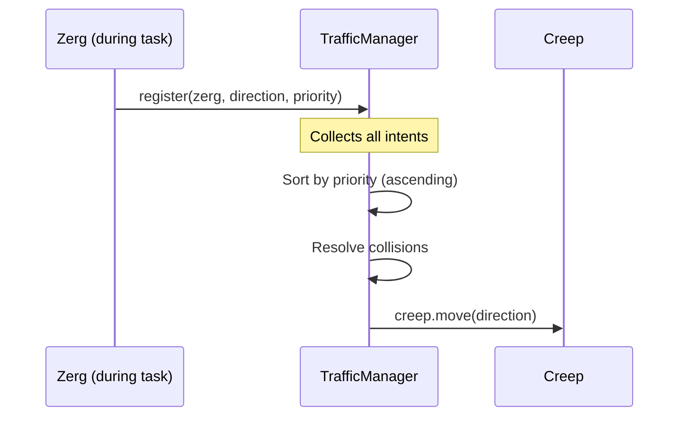

# Traffic Manager

[← Home](index)

The **TrafficManager** (`src/os/infrastructure/TrafficManager.ts`) resolves all creep movement intents at the end of each tick. Instead of each creep calling `move()` independently (causing collisions and deadlocks), all movement is batched, sorted by priority, and resolved centrally.

---

## How It Works



### Per-Tick Flow

1. **Registration phase** — Zergs call `TrafficManager.register()` during task execution
2. **Resolution phase** — `TrafficManager.run()` is called once at end of tick in `main.ts`
3. **Cleanup** — All intents are cleared (`finally` block prevents intent bleed on crash)

---

## Collision Resolution

When a creep wants to move to an occupied tile:

| Scenario | Resolution |
|---|---|
| **Blocker is stationary** | If moving creep has high priority (< 10), **shove** the blocker to a random adjacent tile |
| **Both moving, same direction** | Lower-priority creep proceeds first (already sorted) |
| **Head-to-head deadlock** | Higher-priority creep forces a **swap** — blocker moves to mover's tile |
| **Blocker is hostile** | Skip collision handling (hostile creep detection via `blocker.my`) |

---

## Shove Logic

When a high-priority creep needs to push a stationary blocker:

1. Shuffle available directions randomly (prevents stuck patterns)
2. Find an open tile that is:
   - Not occupied by another creep
   - Not blocked by an obstacle structure
   - Not a wall tile
   - Not on a room border (prevents exit bouncing)
3. If no open tile exists, fall back to a **swap** (blocker moves to mover's position)

### Protections

| Protection | Rule |
|---|---|
| **Static miners** | Creeps with `role === "miner"` are never shoved |
| **Exit bouncing** | Positions at `x/y === 0 or 49` are excluded from shove targets |
| **Intent bleed** | `finally` block guarantees state clearing even if `.run()` throws |

---

## API

```typescript
class TrafficManager {
    // Called by Zergs during task execution
    static register(zerg: Zerg, direction: DirectionConstant, priority: number): void;

    // Called once per tick in main.ts
    static run(): void;
}
```

---

**Related:** [Zerg](zerg) · [Main Loop](main-loop) · [Design Patterns](design-patterns)
